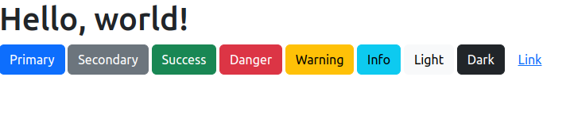
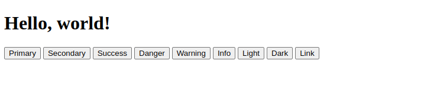

# Get_started_with_Bootstrap
Bootstrap is a powerful, feature-packed frontend toolkit. Build anything—from prototype to production—in minutes.<br>

# Quick start
Get started by including Bootstrap’s production-ready CSS and JavaScript via CDN without the need for any build steps.<br>

## Create a Html file
Create a new index.html file in your project root. Include the `<meta name="viewport">` tag as well for proper responsive behavior in mobile devices.

```html
<!doctype html>
<html lang="en">
  <head>
    <meta charset="utf-8">
    <meta name="viewport" content="width=device-width, initial-scale=1">
    <title>Bootstrap demo</title>
  </head>
  <body>
    <h1>Hello, world!</h1>
  </body>
</html>
```

## Edit the HTML file
Include Bootstrap’s CSS and JS. Place the `<link>` tag in the `<head>` for our CSS, and the `<script>` tag for our `JavaScript` bundle (including `Popper` for positioning dropdowns, poppers, and tooltips) before the closing `</body>`.

```html
<!doctype html>
<html lang="en">
  <head>
    <meta charset="utf-8">
    <meta name="viewport" content="width=device-width, initial-scale=1">
    <title>Bootstrap demo</title>
    <link href="https://cdn.jsdelivr.net/npm/bootstrap@5.3.3/dist/css/bootstrap.min.css" rel="stylesheet" integrity="sha384-QWTKZyjpPEjISv5WaRU9OFeRpok6YctnYmDr5pNlyT2bRjXh0JMhjY6hW+ALEwIH" crossorigin="anonymous">
  </head>
  <body>
    <h1>Hello, world!</h1>
    <script src="https://cdn.jsdelivr.net/npm/bootstrap@5.3.3/dist/js/bootstrap.bundle.min.js" integrity="sha384-YvpcrYf0tY3lHB60NNkmXc5s9fDVZLESaAA55NDzOxhy9GkcIdslK1eN7N6jIeHz" crossorigin="anonymous"></script>
  </body>
</html>
```

- <p>You can also include Popper and our JS separately. If you don’t plan to use dropdowns, popovers, or tooltips, save some kilobytes by not including Popper.<p><br>

## Run Live Server to Test
Check if you have **`Live Server`** extension in your **`VSCode`** to Launch a development local Server with live reload feature for static & dynamic pages.<br>

## Shortcuts to Start/Stop Server
**NOTE: 
[ In case if you don't have any `.html` or .`htm` file in your workspace then you have to follow method no 4 & 5 to start server. ]**
1. Open a project and click to **`Go Live`** from the status bar to turn the server on/off.
2. **`Right`** click on a `HTML file` from Explorer Window and click on Open with `Live Server`.
3. Open a `HTML` file and right-click on the editor and click on `Open with Live Server`.
4. Hit (`alt+L`, `alt+O`) to **Open the Server** and (`alt+L, alt+C`) to Stop the server (You can change the shortcut form keybinding). [On MAC, `cmd+L`, `cmd+O` and `cmd+L`, `cmd+C`]
5. Now you must see **`Hello, world!`** with diferents examples of buttons in the Bootstrapped page in your browser of choice. 
> index-bootstrapped 
6. If you want to compare try: `standar-html5-file.html` and you will see.
> standar-html5-file  

## Done
Now you can start building with Bootstrap by creating your own layout, adding dozens of components, and utilizing the official examples.
